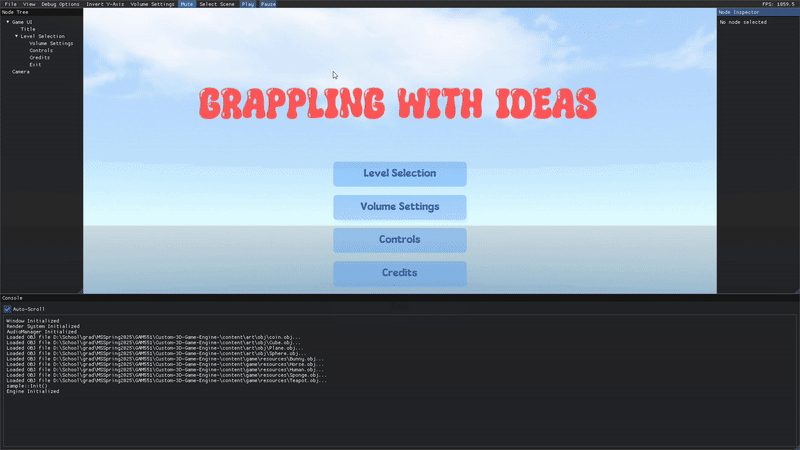
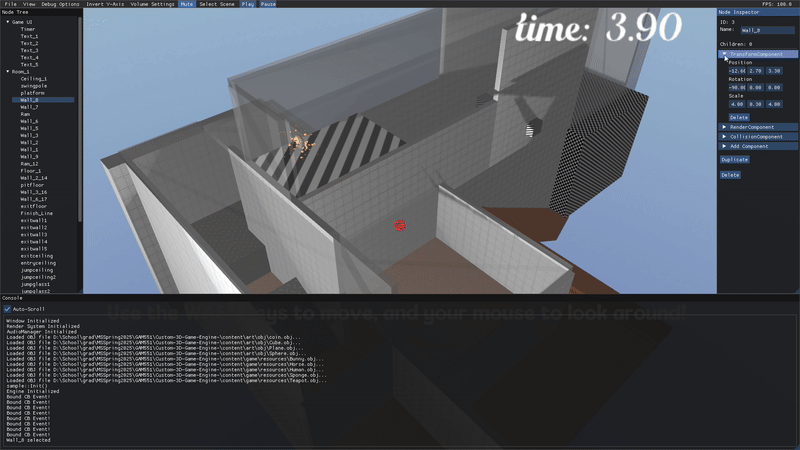
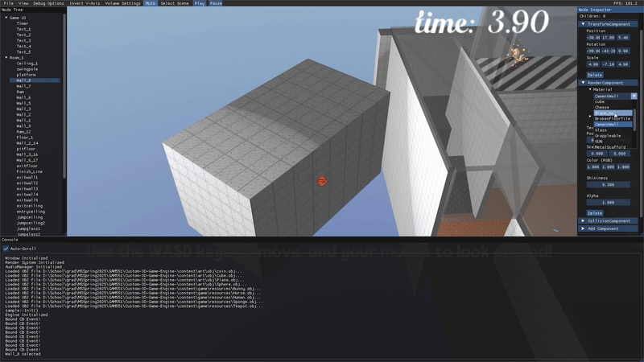

# Stolen Engine

A modular 3D game engine built from scratch in C++ and OpenGL, designed for performance, usability, and extensibility. It supports real-time rendering, pre-pass shader management, and dynamic scene manipulation with high efficiency.
Engine made by team WyldPunksOnABridgeOfStolenBeans.

---

## Core Features

### Scene Transition

Switch between scenes seamlessly while maintaining persistent data and engine state.

---

### Object Manipulation

Manipulate objects in real-time:
- Translate, scale, and rotate
- Matrix updates reflected instantly

---

### Tiling & Material Shifting

Update material properties on the fly for aesthetic variation and gameplay feedback:
- Texture changes
- Shader-bound uniform refresh

---

## System Utilities

### Resource Control

#### Automated Import/Export

- Scene and asset data (meshes, textures, materials) are serialized/deserialized using **JSON**

#### In-Engine Scene Saving

- Save current scene state to disk directly from the editor
- Includes all transforms, components, and resources

#### Resource file auto generation

- Generates a new JSON file
    1. If current scene is not found in path. It uses the current scene title
    2. If new material is added to the environment
 
### Pre-Pass System

The engine features a **pre-pass shader system**:
- Ensures a consistent base shader is always applied (for global lighting/shadow consistency)
- Enables **user-defined shader overlays** (e.g., outline, dissolve, highlight) without breaking default rendering
---

## Built-in Demo

> Includes a 15-minute **grappling game prototype** showcasing full engine functionality, including:
- Real-time scene switching
- Physics-based movement
- Shader/material updates
- Interactive objects

---

## Tech Stack

- Language: **C++17**
- Graphics: **OpenGL 4.3**
- Serialization: **nlohmann/json**
- Input: GLFW + Custom bindings
- UI: ImGui (for development interface)

---

