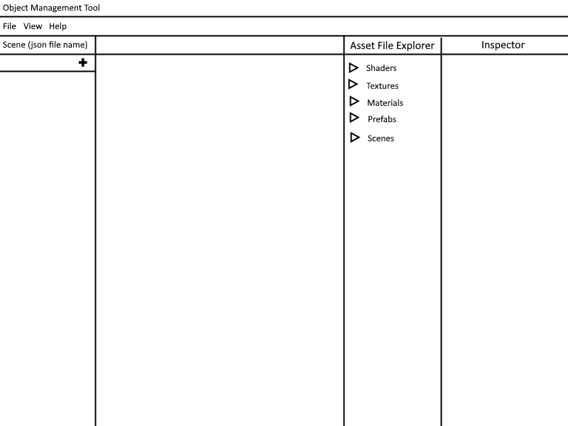

# System Design Document for Game Object Blueprint Tool

## 1. Overview
This document outlines the system design for a tool that enables users to create, modify, and structure in-game objects (e.g., GameObjects and their components) through a visual interface. The primary purpose of the tool is to generate a **blueprint in JSON format** that can be parsed by the game engine to recreate the environment in-game. The tool supports loading assets, modifying object properties, and saving the final structure as JSON for use by the game engine.

---

## 2. Functional Requirements

| Priority | Requirements |
|----------|--------------|
| P0       | Users can load assets (e.g., FBX, OBJ, textures) via drag-and-drop or manual search. |
| P0       | Users can view the loaded assets in a list. |
| P0       | Users can create new game objects within the app and name them. |
| P0       | Users can add components (e.g., render, physics, custom components) to game objects. |
| P0       | Users can modify the transform (position, rotation, scale) of game objects through an inspector panel. |
| P0       | The tool generates a JSON blueprint of the current game object structure for engine parsing. |
| P0       | Users can save the current state (game objects, transforms, components) to a JSON file. |
| P0       | The tool automatically loads the most recent asset JSON on startup. |
| P0       | Users can remove or reconfigure components of a game object. |
| P1       | Users can preview assets and game objects in an inspector panel (non-3D). |
| P2       | Users can interact with the asset list to sort or group objects. |
| P3       | The tool supports loading and displaying 3D models (FBX, OBJ) in an OpenGL-based preview panel. |

---

## 3. Operational Requirements

| Priority | Requirements |
|----------|--------------|
| P0       | The tool must output a structured JSON file that conforms to the requirements of the game engine. |
| P0       | The tool must allow users to add, remove, and configure game objects and their components easily. |
| P0       | The JSON blueprint must be consistently saved and loaded across different sessions. |
| P1       | The system should provide responsive interaction in the inspector panel and UI, even with many game objects and assets. |
| P1       | The tool should support drag-and-drop functionality for ease of asset import. |
| P3       | OpenGL integration should be optimized for smooth 3D model rendering in the preview panel. |

---

## 4. System Architecture

This tool is designed to create a visual editor that generates a structured JSON blueprint for game objects, components, and their transforms. The blueprint is then used by the game engine to recreate the game environment.

### 4.1 Frontend Architecture

- **WPF Panels**: The main user interface will be organized into three panels:
  - **Game Objects Panel**: Lists the game objects in the scene and allows adding or removing objects.
  - **Inspector Panel**: Provides an interface to modify the properties (e.g., transform, components) of the selected game object.
  - **Asset File Explorer**: Displays the assets (e.g., FBX models, textures) available for use for the game object.

- **JSON Generation**:
  - The main output of the tool will be a structured JSON file representing the game objects, their transforms, and components.
  - The blueprint JSON will follow a predefined schema to ensure compatibility with the game engine.



### 4.2 Backend Architecture

- **Asset Manager**: Handles the loading, parsing, and management of assets (e.g., FBX, OBJ models, PNG textures).

- **GameObject Manager**: Manages the hierarchy of game objects in the scene, including their transforms and components. 
  - Handles the addition, deletion, and modification of game objects and components.

- **JSON Handler**:
  - Handles the serialization and deserialization of game objects into JSON format.
  - On startup, the tool will automatically load the most recent asset JSON blueprint.

---

## 5. Data Model

The primary output of this tool is a JSON blueprint that defines the structure of the game objects in the scene. This section outlines the expected structure of the JSON file.

### 5.1 JSON Blueprint Structure

The tool will output a JSON file that represents the entire scene, including game objects, their components, and transforms.

```json
{
  "gameObjects": [
    {
      "id": "go_001",
      "name": "Player",
      "transform": {
        "position": [0, 0, 0],
        "rotation": [0, 0, 0],
        "scale": [1, 1, 1]
      },
      "components": [
        {
          "type": "RenderComponent",
          "properties": {
            "material": "asset_001"  // Reference to the Asset JSON
          }
        }
      ]
    }
  ]
}

```

The JSON file will be structured such that the game engine can parse and recreate the environment based on the properties and components defined within it.

---

## 6. UI/UX Design

The user interface will be designed to help users create and configure game objects visually. The tool will follow a panel-based layout to allow users to interact with the game objects and assets intuitively.

### 6.1 Game Objects Panel

- **Purpose**: This panel will display the list of game objects currently in the scene and allow the user to manage them.
- **Features**:
  - Users can add a new game object, which will appear in the list.
  - Users can rename a game object by double-clicking its name.
  - Users can delete a game object from the scene.
  - Clicking on a game object will display its details in the Inspector Panel for modification.

### 6.2 Inspector Panel

- **Purpose**: This panel allows users to modify the selected game object's properties.
- **Features**:
  - **Transform Properties**: Users can modify the position, rotation, and scale of the selected game object.
  - **Components**: Users can view the current components (e.g., RenderComponent, PhysicsComponent) and modify their properties.
  - **Add/Remove Components**: Users can add new components to the selected game object or remove existing ones. For example, adding a RenderComponent allows users to specify a material or texture.

### 6.3 Asset File Explorer Panel

- **Purpose**: This panel will show the list of loaded assets (e.g., models, textures) and allow users to apply them to game objects.
- **Features**:
  - Displays a list of available assets with their names and types.
  - Users can drag assets (e.g., textures, models) from this panel to game objects listed in the **Game Objects Panel** to apply them.
  - A preview image or information about the asset is shown when the user selects an asset.
  
### 6.4 Separate JSON Files for Assets and Scene

- **Asset JSON**:
  - Stores all the assets (e.g., models, textures) that are available for use across multiple scenes in the game.
  - When a new asset is added or removed, the tool will update the **Asset JSON**.
  - Example structure:
  
  ```json
  {
    "assets": [
      {
        "id": "asset_001",
        "name": "MetalTexture",
        "type": "Texture",
        "path": "assets/textures/metal.png"
      },
      {
        "id": "asset_002",
        "name": "PlayerModel",
        "type": "Model",
        "path": "assets/models/player.fbx"
      }
    ]
  }
  ```

---

## 7. Use Cases

### 7.1 Creating a Game Object and Assigning Assets

- The user creates a new game object in the **Game Objects Panel**.
- The user assigns a name to the game object and modifies its transform properties in the **Inspector Panel**.
- The user adds components (e.g., a RenderComponent) to the game object in the **Inspector Panel**.
- The user drags an asset (e.g., a texture or model) from the **Asset Preview Panel** and drops it onto the game object.
- The tool updates the **Scene JSON** to include the new game object with its associated transform and components.
- The system automatically ensures the asset being applied is present in the **Asset JSON**, and if not, adds it to the **Asset JSON**.
- Upon adding or removing any asset, the **Asset JSON** is automatically saved to ensure up-to-date asset information is maintained across sessions.

### 7.2 Saving and Loading Scene and Asset Files Separately

#### Saving:
- The user clicks the **Save Scene** button to save the current game objects and their configurations into a **Scene JSON** file.
- **Asset JSON** is automatically saved whenever a new asset is added or an existing one is removed, ensuring up-to-date asset data without requiring explicit user action.

#### Loading:
- The tool first loads the **Asset JSON** to populate the available assets.
- The tool then loads the **Scene JSON**, which references the loaded assets, and creates game objects in the scene based on the saved data.
- The user can switch between different scenes by loading different **Scene JSON** files while maintaining the same **Asset JSON** across sessions.

### 7.3 Modifying a Scene with Existing Assets

- The user loads an existing **Scene JSON** and **Asset JSON**.
- The **Game Objects Panel** displays the game objects from the scene, and the **Asset Preview Panel** shows the assets from the asset file.
- The user can add new game objects or modify existing ones by selecting assets already in the **Asset JSON**.
- Any changes to game objects (e.g., modifying transforms or components) are reflected in the **Scene JSON** when saved.
- If new assets are introduced or removed, the **Asset JSON** is automatically updated and saved.

### 7.4 Reusing Assets Across Multiple Scenes

- The user works on multiple scenes but uses the same **Asset JSON** for consistency.
- The user can add new assets during the creation of one scene, and those assets will be automatically saved and available when switching to a different scene that uses the same **Asset JSON**.
- **Scene JSON** files remain scene-specific, containing only the game objects and their configurations, while **Asset JSON** remains global across all scenes.

---

## 8. Non-Functional Requirements

- **Performance**: The tool must handle large scenes with multiple game objects and a large number of assets without performance degradation.
- **Usability**: The interface should be intuitive, providing an easy way to manage both scene-specific data and global asset data across different scenes.
- **Separation of Concerns**: The system must ensure a clear separation between scene-specific game objects (saved in **Scene JSON**) and reusable assets (saved in **Asset JSON**), ensuring that assets can be reused across different scenes.
- **Reliability**: The system must reliably save and load **Scene JSON** and **Asset JSON** files, ensuring that references between game objects and assets are maintained without data corruption or loss.
- **Automatic Asset Saving**: The system must automatically save the **Asset JSON** whenever assets are added or removed, ensuring that the asset data is always up to date without requiring manual intervention from the user.
- **Compatibility**: The generated **Scene JSON** and **Asset JSON** must follow a consistent structure that the game engine can reliably parse to recreate the environment and apply assets correctly.

